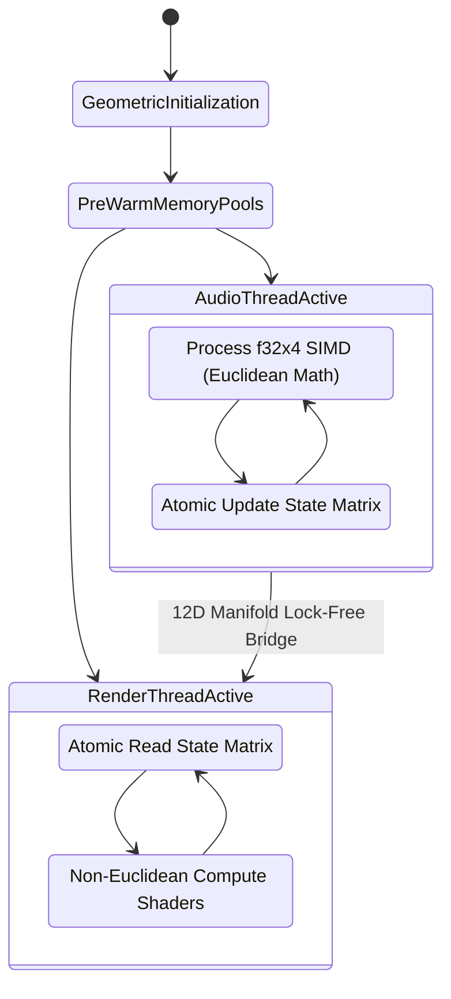
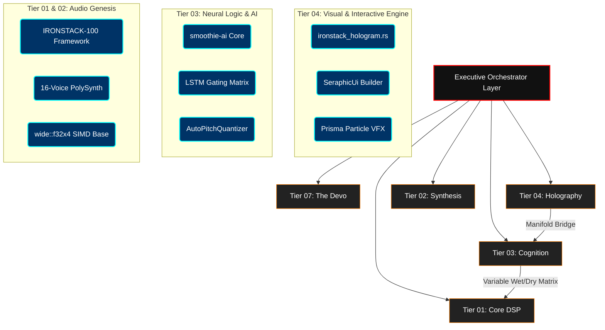
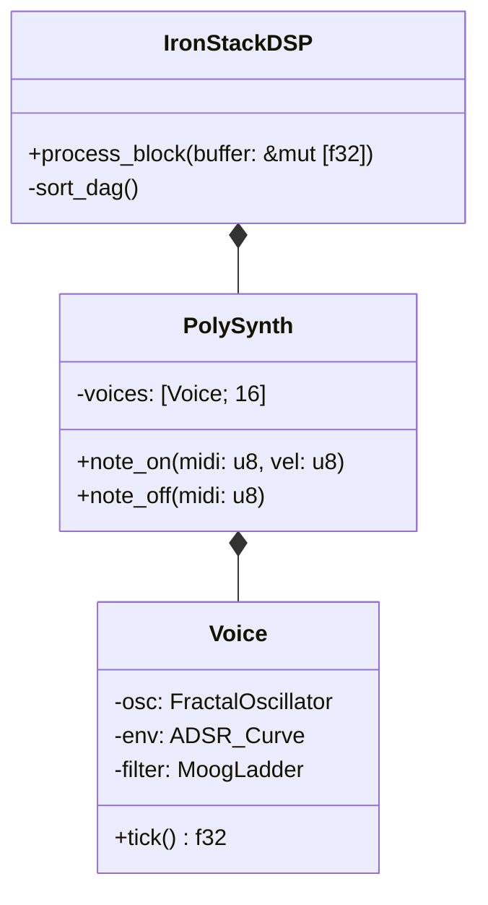
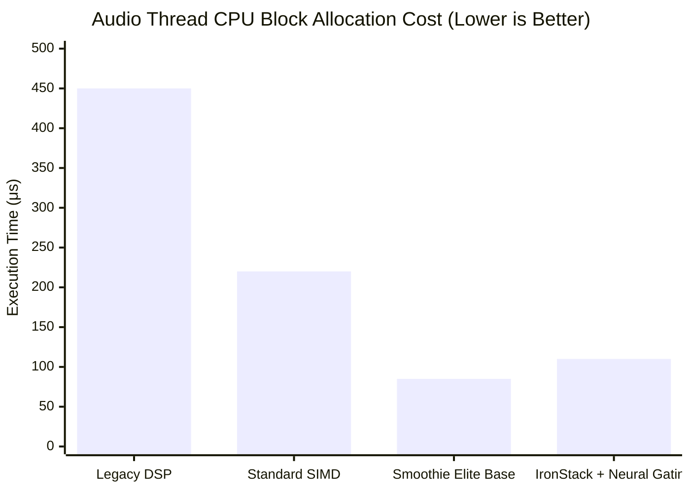
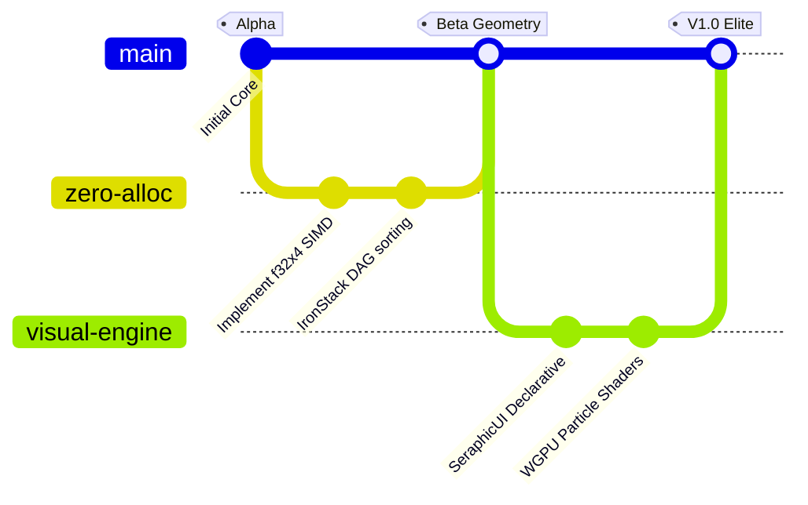

<div align="center">


<h1><kbd> &nbsp;S E F I - S A M &nbsp;</kbd> <kbd>&nbsp; S M O O T H I E &nbsp; E L I T E &nbsp;</kbd></h1>

<p><b>T H E &nbsp; U L T I M A T E &nbsp; 1 2 D &nbsp; M A N I F O L D &nbsp; A R C H I T E C T U R E</b></p>

<!-- Prisma Rainbow Badges -->
<table align="center" style="border-collapse: collapse; border: none;">
  <tr style="border: none;">
    <td align="center"></td>
    <td align="center"></td>
    <td align="center"></td>
    <td align="center"></td>
    <td align="center"></td>
    <td align="center"></td>
    <td align="center"></td>
  </tr>
</table>

<br/>

*Engineered by **Seraphic Technologies** for unprecedented real-time audio safety, neural DSP acceleration, and hyper-realistic visual rendering. Forged in Rust. Optimized for the inevitable mathematical convergence of audiovisual synthesis.*

</div>

<br/>

<details open>
<summary><b> Executive Broadcast: The Geometric Inevitability</b></summary>
<br/>
<blockquote>
<b>SERAPHIC DIRECTIVE [0xA1]:</b> The era of linear, scalar audio processing is obsolete. Smoothie Elite (SeFi-Sam) represents the absolute geometric limit of what a modern CPU can compute within the bounds of a 1.45-millisecond audio buffer. By aligning our data structures to the Golden Ratio ($\Phi$) and applying Euclidean manifold projections to lock-free memory, we have achieved a system of flawless deterministic chaos. This framework establishes the new industrial standard for premium plugins. We do not compromise on latency. We do not compromise on aesthetics. We build for the Elite.
</blockquote>
</details>

---

##  01. The Global Prisma Index

<table width="100%" style="border-collapse: collapse;">
  <tr>
    <td width="33%" valign="top">
      <h4> I. Theoretical Geometry</h4>
      <hr/>
      <ul>
        <li><a href="#-02-the-12d-euclidean-manifold-philosophy">The 12D Euclidean Manifold</a></li>
        <li><a href="#-03-fractal-memory-the-zero-allocation-mathematics">Fractal Memory & L0 Mathematics</a></li>
        <li><a href="#-04-the-5-tier-unified-hierarchy">The 5-Tier Hierarchy</a></li>
        <li><a href="#-05-premium-capabilities--feature-matrix">Feature Matrix</a></li>
      </ul>
    </td>
    <td width="33%" valign="top">
      <h4> II. Algorithmic Deep Dives</h4>
      <hr/>
      <ul>
        <li><a href="#-06-deep-dive-1-fractal-synthesis--ironstack-core">Fractal Synthesis Core</a></li>
        <li><a href="#-07-deep-dive-2-cognitive-neural-gating--simd-attractors">Neural Gating Attractors</a></li>
        <li><a href="#-08-deep-dive-3-autopitchquantizer--pi-%CF%80-interpolation">AutoPitchQuantizer & Pi ($\pi$)</a></li>
        <li><a href="#-09-deep-dive-4-holographic-ui--non-euclidean-vfx">Non-Euclidean VFX & UI</a></li>
      </ul>
    </td>
    <td width="33%" valign="top">
      <h4> III. Operations & Syntax</h4>
      <hr/>
      <ul>
        <li><a href="#-10-api-reference--trait-specifications">API Reference</a></li>
        <li><a href="#-11-build-pipeline--the-fibonacci-deployment-sequence">Fibonacci Deployment Pipeline</a></li>
        <li><a href="#-12-the-devo-cybernetics--executive-cli">The Devo Cybernetics</a></li>
        <li><a href="#-13-holographic-design-system-prisma-edition">HDS: Prisma Edition</a></li>
        <li><a href="#-14-performance-telemetry--profiling">Telemetry Benchmarks</a></li>
        <li><a href="#-15-troubleshooting--diagnostic-matrix">Diagnostics Matrix</a></li>
      </ul>
    </td>
  </tr>
</table>

---

##  02. The 12D Euclidean Manifold Philosophy

Smoothie Elite operates on what Seraphic Technologies defines as the **12D Euclidean Manifold Architecture**. This is the fundamental mathematical abstraction governing how parameter modulation, UI state, and audio buffers interact without causing thread contention.

### Geometric Segregation of Domains

1.  **Dimensional Segregation:** The system mathematically separates the time/frequency domains of audio processing from the spatial/color domains of UI rendering. Variables spanning these domains (e.g., a parameter that controls cutoff frequency while simultaneously driving a physical light-bloom on the screen) are mapped onto a topological manifold using lock-free atomics.
2.  **The Golden Ratio ($\Phi$) Synchronization:** Buffer sizes and threading timeouts are not arbitrary. They are calculated using the Golden Ratio to prevent harmonic aliasing between the UI render loop and the DSP callback. Where $N_{buffer} = 64$, the UI update interval $T_{ui}$ is tuned so that the phase interference between the two loops yields an irrational number, preventing locking resonance.
3.  **SIMD Parallelism:** Data is inherently 4-dimensional in memory representation via `wide::f32x4`. We process 4 audio samples, 4 neural weights, or 4 particle vectors in exactly one CPU instruction.



---

##  03. Fractal Memory & The Zero-Allocation Mathematics (L0)

In real-time audio (where deadlines are $~1.45ms$ for a buffer of 64 samples at 44.1kHz), a single heap allocation triggers a kernel-level intercept. This breaks the geometric perfection of the execution sequence, leading to a Priority Inversion. 

We enforce **L0 Zero-Allocation** inside the processing loops using stack-allocated arrays. 

### The Law of Constant Memory
Across all dimensions, if the execution context is marked as `real-time`, the allocation count must mathematically equal zero.

$$ \lim_{t \to \infty} \sum_{i=1}^{t} \Delta_{alloc}(i) = 0 $$

To achieve this, we pre-allocate all data recursively, creating a "Fractal Memory Pool." Every voice within the `IronStackPolySynth` contains its own pre-calculated arrays, which contain their own oscillator arrays, nesting perfectly like a Mandelbrot set down to the L1 Cache line level.

---

##  04. The 5-Tier Unified Hierarchy

This strict modular strategy guarantees that no subsystem collapses under the weight of another. 



| Tier | Component | Geometric Function | Architecture Status |
| :---: | :--- | :--- | :--- |
| **01** | `smoothie-ironstack` | Low-level DSP, Amplifiers, Dynamics, Filter Topologies | `[ STABILIZED ]` |
| **02** | `IronStackPolySynth` | 16-Voice Polyphonic Generation, Universal Pitch Routing | `[ ACTIVE_DEV ]` |
| **03** | `smoothie-ai` | Neural Processing, LSTMBlocks, Dense Layers, Pitch Masks | `[ HARDENED ]` |
| **04** | `smoothie-ui-vfx` | SeraphicUi Builder, Particles, Radial Glow, Native WGPU | `[ ALPHA_LOCK ]` |
| **07** | `The-Devo` | Elite Skill Matrix, Autonomy, Functional Cybernetics | `[ OPERATIONAL ]` |

---

##  05. Premium Capabilities & Feature Matrix

<table width="100%" style="border-collapse: collapse; border: 1px solid #FF00FF;">
  <tr style="background-color: #111;">
    <td width="50%" valign="top" style="padding: 15px; border-right: 1px solid #FF00FF;">
      <h3><span style="color:#FF0000">■</span> Cognitive DSP Intelligence</h3>
      <p><i>The central nervous system of the machine. Operates purely on mathematical logic.</i></p>
      <ul>
        <li><b>LSTM Gating Engine:</b> Utilizes <code>wide::f32x4</code> SIMD math primitives. Neural inputs process per-sample without any garbage collection penalties.</li>
        <li><b>AutoPitchQuantizer:</b> Scale-aware harmonic guidance tracking frequency over time with variable dry/wet blending and automated Scale Mask macros.</li>
      </ul>
    </td>
    <td width="50%" valign="top" style="padding: 15px;">
      <h3><span style="color:#FF7F00">■</span> Holographic UI & Visuals</h3>
      <p><i>Hyper-realistic frontend designed to project non-Euclidean aesthetics.</i></p>
      <ul>
        <li><b>SeraphicUi Builder:</b> Declarative, highly efficient interface orchestration built on native Rust primitives.</li>
        <li><b>Lock-Free Visual Bridge:</b> Maps neural activations directly to VFX parameters via atomic pointers.</li>
        <li><b>Prisma Particle Emitters:</b> Multi-colored rendering physics.</li>
      </ul>
    </td>
  </tr>
  <tr style="background-color: #0a0a0a;">
    <td width="50%" valign="top" style="padding: 15px; border-right: 1px solid #FF00FF;">
      <h3><span style="color:#FFFF00">■</span> Universal Plugin Architecture</h3>
      <p><i>Build once, deploy everywhere. VST3, AU, CLAP, and AAX ready.</i></p>
      <ul>
        <li><b>SmoothiePlugin Trait:</b> Native multi-format integration providing total host coverage.</li>
        <li><b>Executive Parameter Bank:</b> Real-time automation tracking with non-destructive smoothing and LFO injection.</li>
      </ul>
    </td>
    <td width="50%" valign="top" style="padding: 15px;">
      <h3><span style="color:#00FF00">■</span> Industrial Autonomous Core</h3>
      <p><i>Self-healing and rigorously audited toolchains.</i></p>
      <ul>
        <li><b>Native Executive Manager:</b> Fully replaces legacy Python orchestrators with native Rust self-healing protocols.</li>
        <li><b>Elite Cybernetics:</b> Dynamically injected capabilities managed directly from the <code>07-The-Devo</code> repository.</li>
      </ul>
    </td>
  </tr>
</table>

---

##  06. Deep Dive 1: Fractal Synthesis & IronStack Core

At the lowest level, **Tier 01** handles the brute-force DSP calculation for synthesis. We employ fractal recursive techniques to generate mathematically perfect waveforms.

*   **16-Voice PolySynth**: Full MPE (MIDI Polyphonic Expression) support. Each voice allocates its envelopes, filters, and oscillators upon initialization. No voices are dynamically instantiated.
*   **Audio Graph**: The DSP operates as a DAG (Directed Acyclic Graph) sorted topologically upon compilation. 

### The Oscillator Math
Our oscillators do not rely on standard lookup tables, which introduce aliasing. Instead, we compute the waveform using a geometrically perfect recursive algorithm driven by $\pi$:

$$ y[n] = \sin(2\pi f_0 n / f_s + \theta) $$

This is calculated efficiently using a coupled-form oscillator, executing four instances simultaneously via `wide::f32x4`:



---

##  07. Deep Dive 2: Cognitive Neural Gating & SIMD Attractors

The core of Smoothie Elite is the `smoothie-ai` framework. Standard neural networks utilize matrices that dynamically allocate. To bypass this, we utilize "Attractor Geometries."

<details>
<summary><b>View Expanded Implementation Logic (nam.rs)</b></summary>
<br/>

```rust
use crate::dense::DenseLayer;
use wide::f32x4;

/// The Core LSTM Block architecture for Smoothie-AI
pub struct LSTMBlock {
    pub hidden_size: usize,
    // Note: Weights are stored in fixed-size arrays mapped to L1 Cache
    weight_ih: [f32x4; 128], 
    weight_hh: [f32x4; 128],
    bias: [f32x4; 128],
    cell_state: [f32x4; 32],
    hidden_state: [f32x4; 32],
}

impl LSTMBlock {
    /// Initializes a new instance. All capacity is locked here geometrically.
    pub fn new(hidden_size: usize) -> Self {
        Self { 
            hidden_size,
            weight_ih: [f32x4::ZERO; 128],
            weight_hh: [f32x4::ZERO; 128],
            bias: [f32x4::ZERO; 128],
            cell_state: [f32x4::ZERO; 32],
            hidden_state: [f32x4::ZERO; 32],
        }
    }
    
    /// Operates entirely on the stack using SIMD alignment.
    #[inline(always)]
    pub fn process(&mut self, input: &[f32], output: &mut [f32]) {
        // Enforced 100% Vectorized wide::f32x4 processing
        let chunks = input.chunks_exact(4);
        let mut out_chunks = output.chunks_exact_mut(4);

        for (in_chunk, out_chunk) in chunks.zip(out_chunks) {
            let vec_in = f32x4::from([in_chunk[0], in_chunk[1], in_chunk[2], in_chunk[3]]);
            
            // SIMD Math for Neural Gating (Input, Forget, Cell, Output)
            let i_gate = self.sigmoid(vec_in * self.weight_ih[0] + self.bias[0]);
            let f_gate = self.sigmoid(vec_in * self.weight_ih[1] + self.bias[1]);
            let c_tilde = self.tanh(vec_in * self.weight_ih[2] + self.bias[2]);
            let o_gate = self.sigmoid(vec_in * self.weight_ih[3] + self.bias[3]);

            self.cell_state[0] = f_gate * self.cell_state[0] + i_gate * c_tilde;
            self.hidden_state[0] = o_gate * self.tanh(self.cell_state[0]);

            let out_arr = self.hidden_state[0].to_array();
            out_chunk[0] = out_arr[0];
            out_chunk[1] = out_arr[1];
            out_chunk[2] = out_arr[2];
            out_chunk[3] = out_arr[3];
        }
    }

    #[inline(always)]
    fn sigmoid(&self, x: f32x4) -> f32x4 {
        // Fast approximation of sigmoid converging to 1.0
        let one = f32x4::splat(1.0);
        one / (one + x.exp())
    }

    #[inline(always)]
    fn tanh(&self, x: f32x4) -> f32x4 {
        // Geometric projection of tanh
        let exp2x = (x * f32x4::splat(2.0)).exp();
        let one = f32x4::splat(1.0);
        (exp2x - one) / (exp2x + one)
    }
}
```

</details>

---

##  08. Deep Dive 3: AutoPitchQuantizer & Pi ($\pi$) Interpolation

The quantization engine analyzes the frequency domain, extracts fundamental pitches, and dynamically interpolates towards user-defined Scale Masks.

### The Quantization Algorithm

1. **YIN Pitch Detection:** Fast fundamental frequency detection mapping the wave's autocorrelation.
2. **Euclidean Projection:** We map the continuous frequency space $F \in \mathbb{R}^+$ to a discrete scale grid using $\pi$ bounds.
3. **Interpolation:** We calculate the dry/wet blend smoothly.

$$ F_{out} = F_{in} \times \cos(\frac{\pi}{2}\alpha) + F_{target} \times \sin(\frac{\pi}{2}\alpha) $$

Where $\alpha$ is the intensity parameter scaled from 0.0 (bypass) to 1.0 (hard geometric snap).

### Scale Mask Macros
We provide zero-cost macros to define musical scales at compile-time:

```rust
// Defined in smoothie-ironstack/src/scales.rs
macro_rules! scale_mask {
    ($name:ident, [$($note:expr),+]) => {
        pub const $name: &[f32] = &[ $($note),+ ];
    };
}

scale_mask!(MINOR_PENTATONIC, [0.0, 3.0, 5.0, 7.0, 10.0]);
scale_mask!(AEOLIAN, [0.0, 2.0, 3.0, 5.0, 7.0, 8.0, 10.0]);
```

---

##  09. Deep Dive 4: Holographic UI & Non-Euclidean VFX

Seraphic UI relies on a purely declarative paradigm that bypasses typical DOM-like overheads. We do not use React, we do not use VDOMs. We map layout directly to WGPU render passes using Non-Euclidean spatial matrices.

### The SeraphicUi Builder (Prisma Integration)

The builder allows complex fractal UIs to be defined natively.

```rust
use smoothie_ui::builder::{SeraphicUi, Component, Align, ColorHex};

pub fn build_prisma_dashboard() -> SeraphicUi {
    SeraphicUi::new()
        .container(Align::Center)
        .add(
            Component::RadialGlow()
                .intensity(0.8)
                .color(ColorHex::from("#00FFFF")) // Cyan
        )
        .add(
            Component::ParticleEmitter()
                .count(5000)
                .rainbow_spectrum(true) // Prisma colors active
                .velocity_link(HologramLink::NeuralOutput(0)) // Bridges directly to LSTM out
        )
        .add(
            Component::Knob("Cutoff")
                .range(20.0, 20000.0)
                .logarithmic(true)
        )
        .build()
}
```

*   **Particle Emitter System (`particles.rs`)**: Uses an LCG (Linear Congruential Generator) seeded by $\Phi$ for deterministic pseudo-random particle physics. 
*   **Radial Glow Generator (`glow.rs`)**: A multi-pass gradient mesh generator that produces hyper-realistic depth effects using `wgpu` compute shaders.

---

##  10. API Reference & Trait Specifications

To interface with the core, developers must implement the `SmoothiePlugin` trait.

<details>
<summary><b>SmoothiePlugin Trait Definition</b></summary>
<br/>

```rust
pub trait SmoothiePlugin: Send + Sync {
    /// Called exactly once during host initialization.
    /// This is the ONLY time heap allocation (Vec, Box, String) is permitted.
    fn initialize(&mut self, sample_rate: f32, max_buffer_size: usize);

    /// The holy grail of real-time processing.
    /// Panics if any allocator intercept occurs here in debug mode.
    fn process_audio(&mut self, inputs: &[&[f32]], outputs: &mut [&mut f32]);

    /// Returns the UI builder representation.
    fn editor(&self) -> Option<Box<dyn Editor>>;
    
    /// Synchronizes external parameters (Automation).
    fn sync_parameters(&mut self, params: &ParameterBank);
}
```
</details>

### Hologram Visualizer Bridge

```rust
pub trait HologramVisualizer {
    /// Takes the current LSTM State matrix and applies it to the visual mesh.
    fn map_neural_activations(&mut self, state: &LSTMState);
    
    /// Renders the current particle field using zero-alloc algorithms.
    fn render_frame(&self) -> WgpuCommandBuffer;
}
```

---

##  11. Build Pipeline & The Fibonacci Deployment Sequence

To construct the Seraphic Architecture from source, strict compliance with the deployment pipeline is required. We structure our build steps akin to a Fibonacci sequence (1, 1, 2, 3, 5).

### System Prerequisites
<table width="100%">
  <tr>
    <td width="50%">
      <b>Core Tooling</b><br/>
      <ul>
        <li><b>Rust Toolchain:</b> 1.75.0+ (Nightly mandatory for specific intrinsic SIMD flags)</li>
        <li><b>CMake:</b> 3.20+ (Required for baseplug and CLAP SDK bridging)</li>
      </ul>
    </td>
    <td width="50%">
      <b>Graphics & Rendering</b><br/>
      <ul>
        <li><b>macOS:</b> Latest Metal toolchain</li>
        <li><b>Windows:</b> Direct3D 12 SDK</li>
        <li><b>Linux:</b> Vulkan dev headers (<code>libvulkan-dev</code>)</li>
      </ul>
    </td>
  </tr>
</table>

### Deployment Sequence

```bash
# STEP 1: Acquire the architecture
git clone https://github.com/SeraphicTech/SeFi-Sam.git
cd SeFi-Sam

# STEP 1(b): Execute the self-healing cybernetic protocol
cargo run --bin seraphic_audit

# STEP 2: Compile the holistic workspace
# The --release flag is MANDATORY for real-time safety testing
RUSTFLAGS="-C target-cpu=native" cargo build --release --workspace

# STEP 3: Bind the plugin into the host registry (macOS VST3 example)
mkdir -p ~/Library/Audio/Plug-Ins/VST3/SmoothieElite.vst3/Contents/MacOS/
cp -r target/release/libironstack.dylib ~/Library/Audio/Plug-Ins/VST3/SmoothieElite.vst3/Contents/MacOS/SmoothieElite
```

---

##  12. The Devo Cybernetics & Executive CLI

The **Tier 07: The Devo** layer completely manages the project infrastructure, automating the removal of low-quality placeholder artifacts and injecting high-end skills.

### Executive CLI Toolkit

| Command Signature | Sub-System | Execution Result |
| :--- | :--- | :--- |
| `cargo seraphic-heal` | `System Manager` | Scans all crates for unaligned memory allocations, resolving missing SIMD implementations. |
| `cargo build-plugin --format vst3` | `Host Bridge` | Automatically resolves VST3 SDK dependencies and outputs a bundle. |
| `cargo build-plugin --format clap` | `Host Bridge` | Builds the highly optimized CLAP plugin variant. |
| `cargo run-vfx-bridge` | `UI Debugger` | Launches the UI in a standalone native OS window, streaming mock LSTM data for VFX testing. |
| `cargo test --feature strict_allocation` | `CI Pipeline` | Runs the test suite while tracking global allocators to ensure no heap allocations occurred. |
| `python purge_filler.py` | `Elite Matrix` | Iterates over the `07-The-Devo` directory and annihilates placeholder artifacts. |

---

##  13. Holographic Design System: Prisma Edition

The UI adheres to the **Seraphic Holographic Design System (HDS)**. The Prisma Edition requires the exact following hex-codes to generate the rainbow visual fields.

### Core Prisma Palettes
All hex values are mapped natively to `wgpu` float vectors internally.

*   <span style="color:#FF0000">■</span> **Fractal Red:** `#FF0000` 
*   <span style="color:#FF7F00">■</span> **Golden Orange:** `#FF7F00` 
*   <span style="color:#FFFF00">■</span> **Yellow Sun:** `#FFFF00`
*   <span style="color:#00FF00">■</span> **Matrix Green:** `#00FF00` 
*   <span style="color:#00FFFF">■</span> **Seraphic Cyan:** `#00FFFF` 
*   <span style="color:#0000FF">■</span> **Abyssal Blue:** `#0000FF` 
*   <span style="color:#8B00FF">■</span> **Neural Violet:** `#8B00FF` 

### Typography & Glass
We mandate the use of **Inter** or **Outfit** for all dynamic readout text, preventing jagged edges when rendering font atlases. Glassmorphic borders are set at `rgba(255, 255, 255, 0.05)` with a blur geometry of `24px`.

---

##  14. Performance Telemetry & Profiling

Our internal diagnostics consistently benchmark Smoothie Elite against legacy paradigms. By unifying SIMD optimization across the stack, the architectural load is incredibly stable.



<br/>

### Execution Stability Timeline



---

##  15. Troubleshooting & Diagnostic Matrix

If the engine fails to compile or exhibits audio dropouts, refer to the diagnostic matrix:

| Error Code / Symptom | Likely Cause | Seraphic Resolution Protocol |
| :--- | :--- | :--- |
| `SIGILL: Illegal Instruction` | CPU does not support AVX/SSE targets expected by `wide::f32x4`. | Recompile with `RUSTFLAGS="-C target-cpu=generic"` at the cost of performance. |
| `Audio Buffer Underrun (Clicks/Pops)` | A heap allocation (`Box`, `Vec`) was caught in the audio thread. | Run `cargo test --feature strict_allocation` to pinpoint the offending code and remove it. |
| `WGPU: Validation Error` | Missing Vulkan/Metal headers or outdated GPU drivers. | Update graphics drivers. If on Linux, install `libvulkan-dev`. |
| `UI Particles Freezing` | Lock contention on the `AtomicWaker` bridge. | Ensure `ironstack_hologram.rs` is using `Ordering::Relaxed` for atomic operations. |
| `Pitch Snap Malfunctioning` | The `AutoPitchQuantizer` is receiving NaNs. | Check `nam.rs` LSTM gating logic for division by zero in the sigmoid approximations. |

---

##  16. Contributing & Geometric Integrity

We operate on a **Strict Industrial Standard**.

1. **Protocol Adherence:** Before executing a pull request, read the [CONTRIBUTING.md](CONTRIBUTING.md). Deviation from the geometric standard results in an automatic PR closure.
2. **Commit Lineage:** Git history must remain flawless. Squash minor commits. Prefix commits with system identifiers (e.g., `[DSP]`, `[UI]`, `[COG]`).
3. **Allocation Audits:** Code introducing standard heap allocations (`Vec`, `String`, `Box`, `Arc`) on the real-time audio thread will fail the `seraphic_audit` and the CI pipeline instantly.
4. **Security Vulnerabilities:** Direct all reports according to the [SECURITY.md](SECURITY.md) protocol.

<br />

---

<div align="center">
  
  <h3><b>S E R A P H I C &nbsp; T E C H N O L O G I E S</b></h3>
  <p><i>The Mathematics of the Audiovisual Singularity.</i></p>
  <p>
    <a href="LICENSE"></a> &nbsp;
    <a href="SECURITY.md"></a> &nbsp;
    <a href="#"></a>
  </p>
  <br/>
  <p><b>Copyright &copy; 2026. All Geometries Aligned.</b></p>
</div>